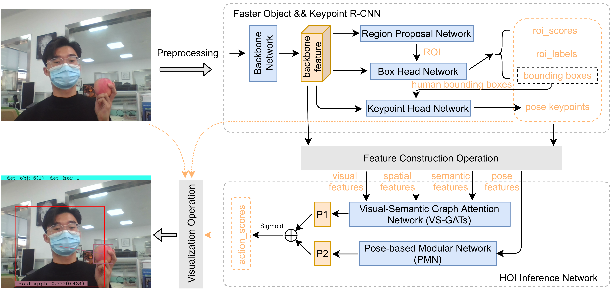

# Detecting Human-Object Interaction in Real. 
In this repository, we offer a system for detecting Human-Object Interaction (HOI) in real scene. 
## Overview of the system
This following diagram illustrates the main components of our system. For the object or pose detector, we directly leverage the off-the-shelf implements in [Pytorch][pytorch]. As for the subsequent HOI inference network, we use our [VS-GATs][vs-gats] and [PMN][pmn]. Among them, is the operation to construct the proper input features for HOI inference network. In the end, we visualize the results in the original image.  

## Quick start
- Download the pretrained checkpoints from [here][checkpoints] and put them in `./checkpoints/` file.
- Run the code

    `python main.py --act_threshold=0.3 --camera --show_line`

  Explanation of some options:
  > `--camera` : use the camera to detect in real. 

  > `--use_pmn` : use the PMN model or not. (**Unavaliable. Something wrong in pose detector**)

  > `--act_threshold` : only the inferred action score exceed this threshold will be shown.

  > `--show_line` : visualize the linked line between the human and the corresponding interacted object.

  > `--show_pose` : visualize the human pose. (**Unavaliable. Something wrong in pose detector**) 

  > `--save_img` : save the original and processed images in `./results/` file.

  > `--save_video` : save the recorded video in `./results/` file.

  > `--obj_det_only` : just detect the objects, without HOI inference.

- Results will be saved in `./results/` file.

## Demo
This is a naive demo. `det_obj` shows the total numbers of detected objects, where the number in the bracket is for detected human. `det_hoi` means the number of detected HOIs.

<!-- LINKER -->
[pytorch]: https://pytorch.org/vision/stable/models.html#object-detection-instance-segmentation-and-person-keypoint-detection
[vs-gats]: https://github.com/birlrobotics/vs-gats
[pmn]: https://github.com/birlrobotics/PMN
[checkpoints]: https://drive.google.com/drive/folders/19eq5o2BsmqjD4eebS-3xBIHl3PMyS5Yd?usp=sharing